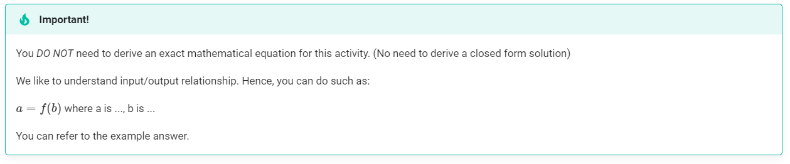
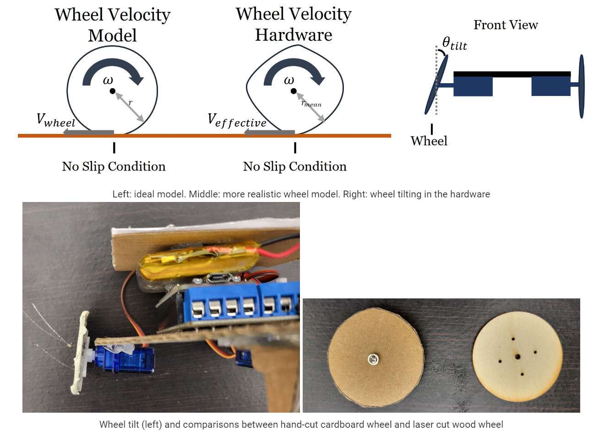

# Analyze Uncertainty

## Deliverables

We have observed some uncertainties in the system. Now we like to understand what are the major sources of such errors.

        
---
## List of possible uncertainty sources

1. Wheel radius
2. Servo motor angular velocities
3. ==Your answer 1==
4. ==Your answer...==

### Wheel radius (Example)
In the model, we assume that the wheel is perfectly circular, which is not a case with hand cut cardboard wheel. 

The wheel is also not perfectly vertically to the ground.

### Servo motor angular velocities 
> ==Your brief explanations==
>

### ==Your answer 1==
> ==Your brief explanations==
> 

### ==Your answer ...==
> ==Your brief explanations==
> 

---
## Mathematically Characterize the sources

### Wheel radius (Example)
#### Mathematical representation
This effect can be captured mathematically by measuring *effective* radius of the wheel. 

where:

* $\omega$ is the angular velocity of the wheel
* $r$ is radius of the wheel
* $V_{wheel}$ is the tangential velocity of the wheel
* $r_{mean}$ is the mean radius of the hardware non-circular wheel
* $\theta_{tilt}$ is the angle offset from the wheel vertical position

Hence,

$r_{effective} = f(r_{mean},  \theta_{tilt})$

$V_{effective} = g(r_{effective},  \omega)$

#### Assumption and limitation
This is assuming no slip and the wheel is still relatively circular. 
This is only considering a constant wheel tilt in one orientation.

If the wheel tilt is variable or 3 dimensional, then we need to derive effective wheel tilt, which will be a non-linear function by itself. 

### Servo motor angular velocities 
#### Mathematical representation
> ==Your brief mathematical explanations==
>

#### Assumption and limitation
> ==Your brief explanations==
>

### ==Your answer 1==
#### Mathematical representation
> ==Your brief mathematical explanations==
>

#### Assumption and limitation
> ==Your brief explanations==
>

---
## Alternate Hardware Designs
### Make wheel circular and attach rigidly (Example)

### ==Your answer 1==
> ==Your brief explanations==
> 

--- 
## Alternate Analytical Model
### Use calculated or measured *effective* radius

### ==Your answer 1==
> ==Your brief explanations==
> 

---

## Apply the modifications 

Apply one of the modifications *you* have suggested above. 
Then redo one of the previous experiments to see if there is any improvement in fact. 

### What have you changed?
> ==Your brief explanations on what you changed==
>

### Conduct experiments
Conduct at least one of the experiment again to see any improvement due to the change
[How well can it go straight?](ws_straight.md)

### Results
#### Observation
> ==Your brief explanations on what change you observed==
>

#### Quantitative results
> ==Your brief explanations on how much improvement it caused==
> ==i.e. the linear velocity gap improved by xx %==
>

### Did the alternation worth doing?
> ==Your brief explanations on whether your modification worth doing compared to efforts necessary==
>

