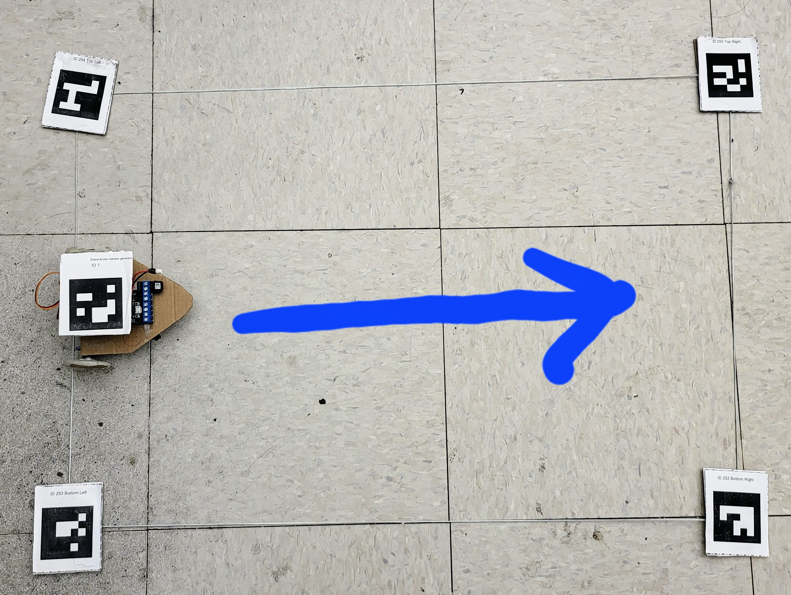

# Experiment: Driving Straight

!!! success "Objective"

        

## Setup

1. Have your MoCap setup ready
2. Place your robot in the middle of the left edge toward the right. (see the image).
3. Drive your robot roughly from the left edge to the right.

## Running experiments
Run the analytical model and the hardware with MoCap using the straight trajectory.
Repeat at least 3 times to collect data.

Your data should be stored under r4a/run_outputs/. 

!!! note

        Running more experiments will let you do more statistical analysis, such as histograms, standard deviation, etc. 
        However, for this workshop, we limit ourselves to a few tries for the time's sake. 

---
## Results
!!! tip 

        You can open the CSV file in Excel to calculate the average linear and angular velocity. 
        
!!! warning "Be careful"

        Initially, mocap will report x:0, y:0, th_z:0 until it captures the robot ID tag. 

        You should remove those data from the velocity calculation. 

### Average linear speed 

??? note "Calculating Linear velocity"
    
        $V_{average} = \sqrt{(\frac{x_{t_{end}} - x_{t_0}}{t_{end} - t_0})^2 + (\frac{y_{t_{end}} - y_{t_0}}{t_{end} - t_0})^2}$

        Where 

        - $V_{average}$ is the magnitude of the linear velocity of the robot
        - $t_{end}$ and $t_0$ are time at the end and the beginning of trajectory
        - $x_{t_{end}}$ and $y_{t_{end}}$ are the x and y position at $t$

#### Analytical Model
For each try:

1. ==xx== m/s 
2. ==xx== m/s
3. ==xx== m/s

Overall average linear velocity was: ==xx== m/s

#### Hardware
For each try:

1. ==xx== m/s 
2. ==xx== m/s
3. ==xx== m/s

Overall average linear velocity was: ==xx== m/s

---
### Angular velocity

??? note "Calculating Angular velocity"
    
        $\Omega_{average} = \frac{\delta \theta}{\delta t} = \frac{\theta_{t_{end}} - \theta_{t_0}}{t_{end} - t_0}$

        Where 

        - $\Omega_{average}$ is the magnitude of the angular velocity of the robot
        - $t_{end}$ and $t_0$ are time at the end and the beginning of trajectory
        - $\theta_{t_{end}}$ and $\theta_{t_0}$ are the robot orientation in 2D world. 

#### Analytical Model
For each try:

1. ==xx== rad/s 
2. ==xx== rad/s 
3. ==xx== rad/s 

Overall average linear velocity was: ==xx== rad/s 

#### Hardware
For each try:

1. ==xx== rad/s 
2. ==xx== rad/s 
3. ==xx== rad/s 

Overall average linear velocity was: ==xx== rad/s 

---
### Comparisons
#### Linear velocity
On average, the hardware was ==xx== % slower than the analytical model.
$\frac{V_{model}-V_{hardware}}{V_{model}}\times 100\%$, where $V_{model}$ and $V_{hardware}$ are 
average analytical model and hardware linear velocity, respectively. 

#### Angular velocity
On average, the hardware had an angular velocity of ==xx== rad/s. This means that the hardware tended to go ==____== side.
